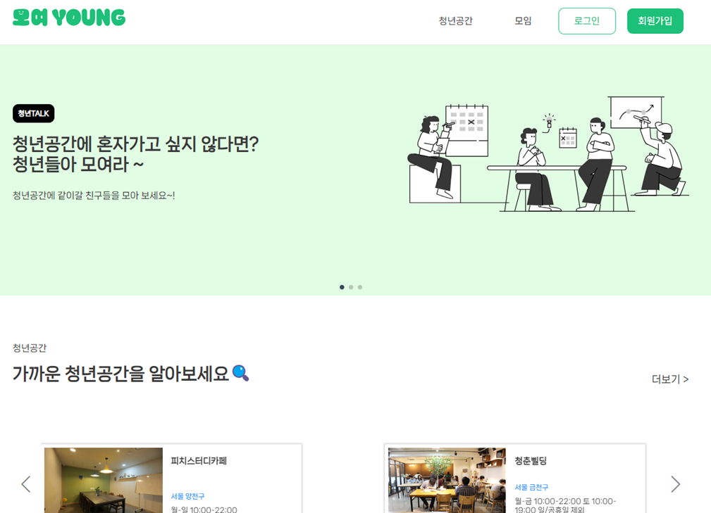
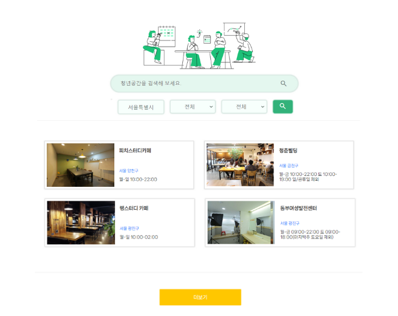
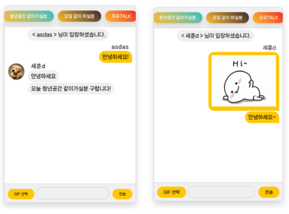
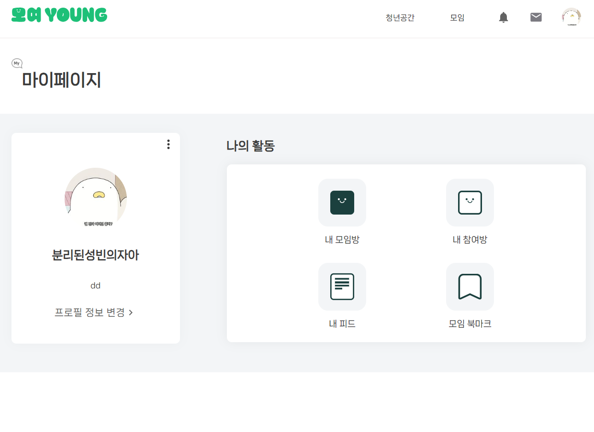
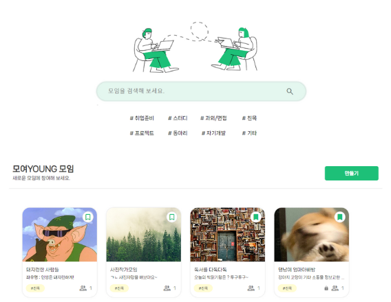
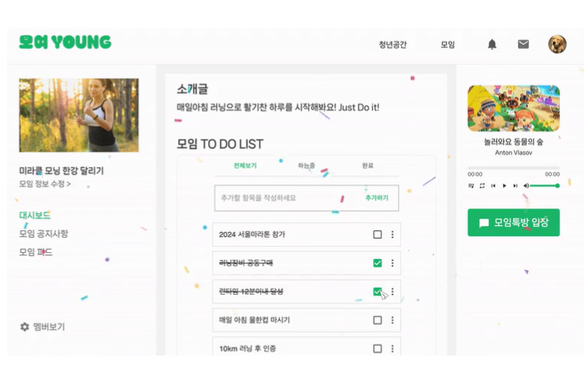

 
 
  

> 온/오프라인 청년공간 제공 웹사이트(프론트엔드 레포지토리)
> 
> 개발기간 : 2023. 06.20~ 2023.07.27
> 
> 5인 팀프로젝트
>
> [백엔드 레포지토리로 이동](https://github.com/binunu/moyeoYoung_backend)

 
 

## 📖 Description  
"모여young"은 카공족들이 사회적인 시선과 편견을 받지 않고

오프라인에서 자유롭게 공부하고 활동할 수 있는 **서울시의 청년공간을 소개**하고

오프라인 공간 뿐 아니라 **온라인 공간인 모임방 활동**을 통해

프로젝트나 취미 등 청년들이 함께 경험을 나눌 수 있는 공간을 제공하는 사이트입니다. 

 
 

## 🐤 Demo

  
 

  
 

 

 

 
 
 

## ⭐ Main Feature
**1. 오프라인 청년공간 검색**
   - 서울시 청년몽땅정보통 페이지 크롤링
  
**2. 오픈 TALK**
   - 웹소켓을 사용해 실시간 사이트 접속 유저간 채팅 

**3. 온라인 모임방 개설**
   - 방장 권한으로 공개/비공개 방 설정에 따른 가입 및 모임방 내 게시글 조회 접근 제한
   - 각 모임방의 게시글 쓰기(멤버만)
   - 투두리스트 및 피드
  

 
 

## 🔧 Stack
- **framework** : springboot, react
  
- **language** : html, css, js, java
  
- **db** : mySQL

- **IDE** : sts, vscode
  
- **tool** : git, figma, google excel, notion, erd cloud

  
